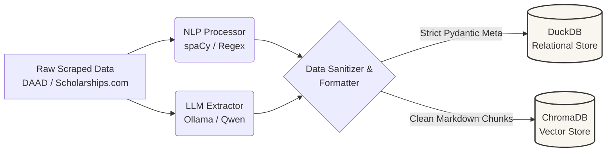
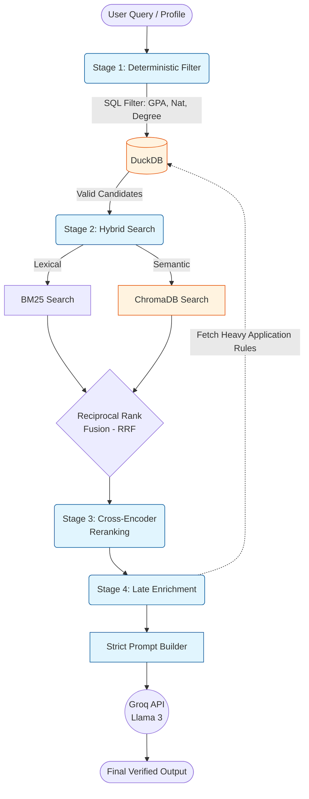

# ScholarAssist - An Intelligent Assistant for Discovering Scholarships and Assisting with Applications

ScholarAssist is an advanced, AI-powered academic assistant designed to streamline the scholarship search and application process. Leveraging a dual-store Retrieval-Augmented Generation (RAG) architecture, the system combines deterministic relational filtering (DuckDB) with semantic vector retrieval (ChromaDB) to accurately match applicants with highly relevant funding opportunities. Beyond intelligent search, it features a strict "Zero-Hallucination" generative engine that parses raw student CVs, drafts highly personalized Statements of Purpose (SOPs), and provides factual, step-by-step application roadmaps based exclusively on verified database records.

This project is built for prospective students seeking tailored international funding opportunities, academic advisors looking to automate the scholarship matching process, and educational institutions aiming to democratize access to global scholarships through a secure, conversational AI interface.


## Table of Contents

- [Problem Statement](#problem-statement)
- [Solution](#solution)
- [Features](#features)
- [System Architecture](#system-architecture)
- [Tech Stack](#tech-stack)
- [Demo](#demo)
- [Project Structure](#project-structure)
- [Dataset](#dataset)
- [Installation](#installation)
- [Usage](#usage)
- [Evaluation](#evaluation)
- [Roadmap](#roadmap)
- [License](#license)
- [Author](#author)


## Problem Statement

Discovering the right scholarship opportunities through traditional search engines and fragmented academic portals is a highly inefficient and overwhelming process for students. The core challenges include:

*   **Information Overload & Strict Constraints:** Students waste countless hours applying for scholarships they are inherently ineligible for due to rigid, hard-coded constraints (e.g., nationality, exact GPA requirements, or specific academic levels).

*   **The LLM "Hallucination" Flaw:** Standard AI chatbots are fundamentally unreliable for academic advising. They frequently invent non-existent scholarships, hallucinate eligibility criteria, or fabricate student experiences when asked to write application letters.

*   **High Application Friction:** Translating a raw, unstructured CV into a highly tailored Statement of Purpose (SOP) that aligns perfectly with a specific scholarship's mandate is a daunting task, particularly for non-native English speakers.


## Solution

**ScholarAssist** solves these challenges by replacing generic LLM interactions with a highly constrained, mathematically grounded **Dual-Store RAG (Retrieval-Augmented Generation) pipeline**. 

By treating user data and scholarship requirements as strict data contracts, the system ensures precision, factual accuracy, and high-quality generation through the following mechanisms:

*   **Advanced Hybrid Retrieval & RRF Ranking:** Overcomes the limitations of single-method search by combining semantic vector retrieval (**ChromaDB**) with exact lexical keyword matching (**BM25**). The retrieved candidates are then dynamically merged and scored using the **Reciprocal Rank Fusion (RRF)** algorithm to ensure highly robust candidate selection, followed by a Cross-Encoder that reranks the final results for deep semantic alignment.

*   **Late Context Enrichment via DuckDB:** To maintain a lightweight and highly performant vector database, heavy textual data—specifically detailed **application processes and instructions**—is deliberately kept out of ChromaDB and stored in a relational **DuckDB** database. Once the top scholarships are identified and ranked, the system seamlessly fetches these lengthy details from DuckDB to provide the user with actionable next steps, significantly optimizing vector memory and search speed.

*   **Automated Data Extraction & Validation:** Parses messy, unstructured CVs using NLP and LLMs, instantly converting them into strictly validated `Pydantic` schemas to ensure clean data enters the matching pipeline.

*   **Zero-Hallucination Generation:** Employs heavily engineered system prompts (Guardrails) to draft compelling Statements of Purpose and application roadmaps. The generative engine is strictly restricted to using only the abstracted skills from the student's actual CV and the verified scholarship details from the database, eliminating fake projects or fabricated experiences.

*   **Late Context Enrichment:** Optimizes system speed and memory by keeping vector chunks lightweight. Heavy text details, such as complex application procedures, are dynamically injected directly from the relational database only after the top candidates are selected.

*   **Cross-Lingual Capability:** Powered by multilingual embeddings (`bge-m3`), the system seamlessly processes native Arabic queries and matches them accurately against English scholarship databases, breaking down language barriers in the search process.


## Features

*   **Automated CV Parsing & Editable Profiles:** Seamlessly extracts data from unstructured student CVs using NLP and LLMs, converting raw text into strictly validated `Pydantic` schemas. Students maintain full control to review, edit, and refine their profile information before initiating the search.

*   **Transparent Hybrid Retrieval & Match Scoring:** Combines semantic vector search (**ChromaDB**) with lexical keyword matching (**BM25**) using **Reciprocal Rank Fusion (RRF)**. The system reranks candidates via a Cross-Encoder and displays a clear **Match Score** for each scholarship, providing users with transparent and highly accurate recommendations.

*   **Interactive AI Advising Assistant:** Features a dedicated conversational chat interface that acts as a personal academic advisor. Students can ask open-ended questions, request detailed explanations of eligibility requirements, compare multiple matched scholarships, and generate step-by-step application roadmaps.

*   **Zero-Hallucination Document Generation:** Dynamically drafts highly personalized Statements of Purpose (SOPs), Motivation Letters, Academic Cover Letters, and application Emails. The generative engine is strictly grounded in verified user facts, gracefully adapting to write strengths-based letters even when scholarship details are brief.

*   **Late Context Enrichment:** Optimizes vector database memory by storing heavy textual data (like detailed application processes) in a relational database (**DuckDB**). These details are dynamically fetched only for top-ranked results to assist the user without slowing down the semantic search.

*   **Cross-Lingual Semantic Matching:** Powered by multilingual embeddings (`bge-m3`), the system natively processes user queries in Arabic, accurately matching them against English-language scholarship databases and breaking down language barriers.


## System Architecture

ScholarAI is built on a highly optimized, state-of-the-art **Dual-Store Retrieval-Augmented Generation (RAG)** architecture. By strictly separating deterministic relational data from semantic vector data, the system achieves zero-hallucination generation, massive memory efficiency, and lightning-fast retrieval.

### 1. The ETL & Data Processing Pipeline
The data ingestion pipeline transforms unstructured scraped HTML/JSON into strictly validated, embedding-ready documents.



### 2. The Dual-Store RAG Pipeline
When a user submits a query or attempts to generate a document, the system executes a multi-stage retrieval and ranking protocol before reaching the LLM.



**Architectural Highlights:**

*  ***Stage 1 (Hard Filtering)***: DuckDB intercepts the query to strictly filter out any scholarships the student is ineligible for, preventing wasted vector searches.

*  ***Stage 2 (Hybrid Search & RRF)***: Combines exact keyword matching with dense vector embeddings (`bge-m3`). The `RRF` algorithm merges the scores mathematically to ensure robust retrieval.

*  ***Stage 3 (Cross-Encoder)***: A BAAI Cross-Encoder re-evaluates the top candidates, pushing the absolute best semantic match to the #1 position.

*  ***Stage 4 (Late Context Enrichment)***: To keep the vector DB lightweight, the system fetches heavy text payloads (like application procedures) directly from DuckDB just milliseconds before passing the context to the LLM.


## Tech Stack

| Category | Technologies |
| :--- | :--- |
| **Programming Language** | Python, JavaScript |
| **Data Processing** | Pandas, NumPy |
| **NLP & Text Extraction** | spaCy, Regex |
| **LLM & API** | Groq API (Llama-3 / Qwen / GPT-OSS), Ollama |
| **RAG Framework** | LangChain |
| **Embeddings & Reranking** | BGE-M3 (Multilingual), BAAI Cross-Encoder |
| **Vector Database** | ChromaDB |
| **Relational Database** | DuckDB (Analytical), SQLAlchemy (ORM) |
| **Retrieval Engine** | Hybrid (BM25 + Semantic Search), RRF Algorithm |
| **Data Validation** | Pydantic V2 |
| **Web Scraping** | BeautifulSoup, Selenium |
| **Backend API** | FastAPI, Uvicorn |
| **Frontend** | React |
| **Testing & Evaluation** | RAGAS (RAG Evaluation), PyTest |

## Demo


## Project Structure

The codebase is modularly structured to separate the API layer, AI engines, data processing pipelines, and database management.

```text
AI_Scholarship/
├── data_Json/          # Raw and processed JSON datasets for scholarships
├── db/                 # Local database files (DuckDB analytical storage)
├── docs/               # MKDocs documentation source files
├── notebooks/          # Jupyter notebooks for EDA, prototyping, and testing
├── src/                # Main application source code
│   ├── api/            # FastAPI routers and endpoint definitions
│   ├── database/       # ORM models, CRUD operations, and DB session management
│   ├── pipeline/       # ETL pipelines for data ingestion and transformation
│   ├── processing/     # NLP extractors and data cleaning logic
│   ├── rag/            # Core AI components (Retriever, Generator, Chunker)
│   ├── schemas/        # Pydantic models for strict data validation (Student, SOP, Chat)
│   ├── scrapers/       # Scripts for scraping and updating scholarship data
│   └── services/       # External service integrations (e.g., PDF parsing)
├── tests/              # Unit tests, database verification, and RAGAS evaluations
├── mkdocs.yml          # Configuration file for MKDocs documentation
├── requirements.txt    # Python dependencies
└── README.md           # Project documentation

```


## Dataset


### Data Source
The system utilizes a custom-curated dataset of **2,526 academic scholarships** sourced from two primary portals:
*   **DAAD (Deutscher Akademischer Austauschdienst):** [`https://www2.daad.de`](https://www2.daad.de) – The primary source for German and European academic funding.

*   **Scholarships.com:** [`https://www.scholarships.com`](https://www.scholarships.com/) – The primary source for US-based and international diverse disciplines.


### Data Collection
Data was systematically scraped and filtered to target specific demographic and academic profiles. The collection specifically focuses on:
*   **Target Demographics:** International students from the MENA region, explicitly covering nationals from **Syria, Egypt, Jordan, and Saudi Arabia**.

*   **Academic Levels:** Comprehensive coverage across **Undergraduates, Graduates (Master's), and Doctoral/PhD candidates**.

*   **Fields of Study:** Multidisciplinary coverage spanning STEM, humanities, and social sciences.


### Data Processing (ETL Pipeline)
To prepare the raw scraped HTML/JSON data for the Retrieval-Augmented Generation (RAG) engine, a rigorous, multi-phase NLP and LLM processing pipeline is executed:

1.  **Rule-Based NER & Taxonomy Standardization:** Utilizes **spaCy** `PhraseMatcher` to normalize messy textual tags into strict hierarchical categories (e.g., mapping "full ride" and "monthly stipend" to `Fully Funded`, or "bsc" to `Undergraduates`).

2.  **LLM-Powered Extraction:** Employs local LLMs (**Ollama / Qwen**) and the **Groq API (Llama-3)** as heavy-duty extractors to parse complex contexts. This includes dynamically extracting the `academic_major` and standardizing application deadlines into a strict `YYYY-MM-DD` format.

3.  **Text Sanitization & Noise Reduction:** A `RagDocumentBuilder` aggressively cleans the data to prevent vector pollution. It strips HTML tags, replaces high-entropy tokens (like raw URLs and emails) with static safe tokens (`[LINK]`, `[EMAIL]`), and removes navigational boilerplate text that causes "ghost vectors" in semantic search.

4.  **Conditional Semantic Imputation:** Identifies records with missing application instructions and injects deterministic fallbacks (e.g., *"Please visit the official scholarship website..."*) to ensure the final LLM always has actionable context and does not hallucinate.


### Data Storage (Dual-Store Architecture)
The processed data is structurally split into a **Dual-Store Architecture** to optimize both deterministic filtering and semantic search:

*   **Relational Database (DuckDB):** Stores strictly validated `Pydantic` metadata (e.g., GPA, nationality, host country, application links, and heavy application instructions). Redundant text columns are dropped to ensure minimal memory footprint and blazing-fast SQL filtering prior to vector search.

*   **Vector Database (ChromaDB):** Stores the semantically clean markdown documents. Documents are processed using a `HybridDocumentChunker` (Chunk size: 800, Overlap: 100) and vectorized using the multilingual **`BAAI/bge-m3`** embedding model, enabling cross-lingual semantic matching (e.g., searching in Arabic for English scholarships).


## Installation

### 1. Clone the Repository
```bash
git clone [https://github.com/shaza-hussein/AI_Scholarship.git](https://github.com/shaza-hussein/AI_Scholarship.git)

cd AI-Scholarship
```


### 2. Create a Virtual Environment:

It is highly recommended to use a virtual environment to manage dependencies.

```powershell
python -m venv venv
```

Activate it:

* Windows :
```powershell
.\.venv\Scripts\Activate.ps1
```

* Linux / macOS:
```bash
source .venv/bin/activate
```


### 3. Install dependencies:

Install all required Python packages using `pip`:

```powershell
python -m pip install -r requirements.txt
```
Note: You must also download the required English language model for `spaCy` to enable the NLP extraction pipeline:

```powershell
python -m spacy download en_core_web_sm
```

### 4. Environment Variables:

The system requires specific API keys to connect to the LLMs and embedding models. Create a local environment file by copying the example template:

*  **Windows**: `copy .env.example .env`

*  **Linux / macOS**: `cp .env.example .env`

Open the newly created `.env` file and configure the following variables:

####  REQUIRED: Groq API Key for the RAG Generator and heavy NLP extraction.
####  You can get a free API key from: [https://console.groq.com](https://console.groq.com)
GROQ_API_KEY="your_groq_api_key_here"

#### OPTIONAL BUT RECOMMENDED: Hugging Face Token.
#### Prevents rate limits and errors when downloading the BAAI/bge-m3 embedding models.
HF_TOKEN="your_huggingface_token_here"


## Evaluation

The ScholarAssist system was rigorously evaluated across its entire pipeline, utilizing a hybrid evaluation framework. This included deterministic unit testing for the relational database (DuckDB), standard Information Retrieval (IR) metrics for the vector search pipeline, and an **LLM-as-a-Judge** framework to evaluate the generative outputs for hallucination and relevancy.

### Retrieval Evaluation (Search & Reranking)

The retrieval pipeline was tested against a heavily noised dataset (including 70+ highly similar "distractor" documents) to measure the robustness of the semantic search and reranking layers.

| Metric | Score | Significance |
| :--- | :--- | :--- |
| **DuckDB Filtering Accuracy** | 100% | Zero leakage. Flawless exclusion of ineligible scholarships based on hard constraints (GPA, Nationality, Degree). |
| **Recall@5 (ChromaDB)** | 90.0% | High capability to retrieve the correct scholarship within the top 5 results despite massive semantic noise. |
| **MRR (Mean Reciprocal Rank)** | 0.84 | Strong baseline ranking of the correct documents before any secondary optimization is applied. |
| **Top-1 Accuracy (Cross-Encoder)** | 100% | The reranker guarantees that the perfectly matched scholarship is pushed to the absolute #1 position. |

### RAG Evaluation (Generation Quality)

The generative layer was evaluated using an LLM-as-a-Judge approach (similar to RAGAS principles) to ensure the outputs are safe, factual, and strictly grounded in the provided context.

| Metric | Score | Significance |
| :--- | :--- | :--- |
| **Faithfulness (Zero Hallucination)** | 100% | The LLM strictly adhered to the retrieved context, fabricating zero external data or fictional student experiences. |
| **Link Compliance / Answer Relevancy** | 100% | The model successfully and consistently embedded the official scholarship application link within every generated response. |
| **Context Precision** | ~100% | Derived from Top-1 Accuracy; the generative model is always fed the most relevant document first. |
| **Context Recall** | ~90.0% | Derived from Recall@5; the system's ability to retrieve all necessary information to answer the query. |

### Overall Results & Limitations


**Key Findings:**
*   **The Dual-Store Architecture Solves Hallucination:** By offloading deterministic constraints (like GPA and Nationality) to DuckDB, the system completely prevents the LLM from hallucinating eligibility, achieving a 100% Faithfulness score.

*   **The Necessity of Cross-Encoders:** While ChromaDB baseline retrieval is strong (MRR 0.84), the integration of the BAAI Cross-Encoder is the critical component that pushes the system to 100% Top-1 Accuracy, ensuring the LLM always sees the best possible match.


**Current Limitations:**
*   **Recall@5 Margin:** A 90% Recall@5 indicates a 10% miss rate in the initial vector retrieval phase when faced with extreme semantic noise. This highlights the ongoing challenge of purely semantic search in highly nuanced academic texts, reaffirming the need for our DuckDB pre-filtering step.

*   **Latency vs. Accuracy Trade-off:** Achieving 100% Top-1 Accuracy requires passing multiple candidates through a Cross-Encoder, which introduces a slight computational latency compared to a single-step vector retrieval.


## Roadmap


- [x] **Data Engineering:** Automated scraping, robust NLP extraction (spaCy), and strict data sanitization.
- [x] **Dual-Store Architecture:** Implementation of DuckDB (deterministic metadata) and ChromaDB (semantic vectors).
- [x] **Advanced Retrieval Pipeline:** Hybrid search (BM25 + Vector), Reciprocal Rank Fusion (RRF), and Cross-Encoder reranking.
- [x] **Generative AI Engine:** Zero-hallucination SOP and email generation with Adaptive Tailoring.
- [x] **Interactive UI:** Conversational advising assistant and editable student profiles.
- [ ] **Evaluation Framework:** Full CI/CD integration of RAGAS for automated retrieval and generation assessment.
- [ ] **User Authentication:** Secure login, persistent chat history, and cloud profile storage.
- [ ] **Containerization:** Dockerize the FastAPI backend, ETL pipeline, and frontend for consistent deployment.
- [ ] **Cloud Deployment:** Deploy the system infrastructure to cloud providers (e.g., AWS, GCP, or Vercel/Render).
- [ ] **Monitoring & Observability:** Integrate tracing tools (e.g., LangSmith, Prometheus) for real-time LLM performance and cost monitoring.


## License

This repository does not include a specific license file.


## Author

**[Shaza Alhussein]**  
*AI Engineer & Data Scientist*

* **GitHub:** [@shaza-hussein](https://github.com/shaza-hussein)
* **LinkedIn:** [Connect with me on LinkedIn](https://www.linkedin.com/in/shaza-alhussein/)

