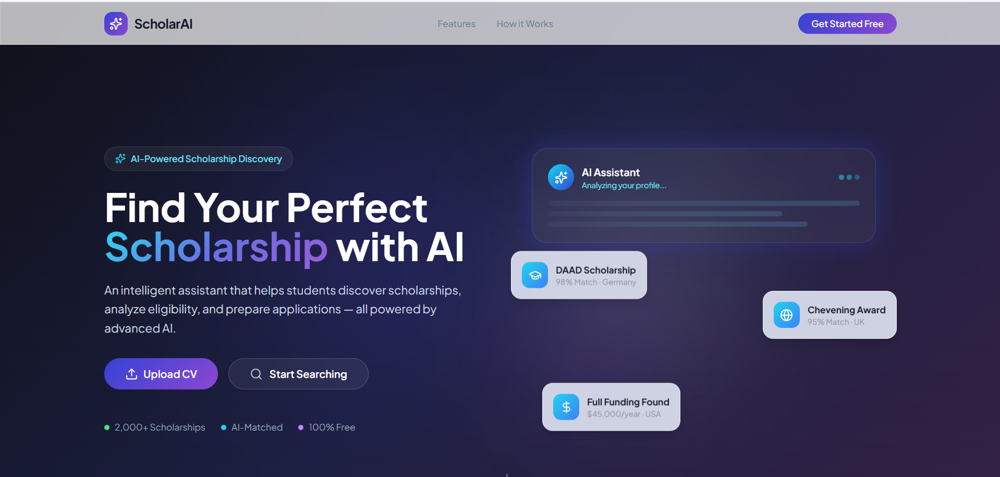

# ScholarAssist - An Intelligent Assistant for Discovering Scholarships and Assisting with Applications

ScholarAssist is an advanced, AI-powered academic assistant designed to streamline the scholarship search and application process. Leveraging a dual-store Retrieval-Augmented Generation (RAG) architecture, the system combines deterministic relational filtering (DuckDB) with semantic vector retrieval (ChromaDB) to accurately match applicants with highly relevant funding opportunities. Beyond intelligent search, it features a strict "Zero-Hallucination" generative engine that parses raw student CVs, drafts highly personalized Statements of Purpose (SOPs), and provides factual, step-by-step application roadmaps based exclusively on verified database records.

This project is built for prospective students seeking tailored international funding opportunities, academic advisors looking to automate the scholarship matching process, and educational institutions aiming to democratize access to global scholarships through a secure, conversational AI interface.




## Table of Contents

- [Problem Statement](#problem-statement)
- [Solution](#solution)
- [Features](#features)
- [System Architecture](#system-architecture)
- [Tech Stack](#tech-stack)
- [Demo](#demo)
- [Project Structure](#project-structure)
- [Dataset](#dataset)
- [Installation](#installation)
- [Usage](#usage)
- [Evaluation](#evaluation)
- [Roadmap](#roadmap)
- [License](#license)
- [Author](#author)


## Problem Statement

<!-- Describe the problem this project aims to solve. -->


## Solution

<!-- Explain the proposed solution and how the system addresses the problem. -->


## Features

<!-- List the main capabilities of the system. -->

- Feature 1
- Feature 2
- Feature 3
- Feature 4
- Feature 5


## System Architecture

<!-- Explain the overall architecture of the system. -->


## Tech Stack


## Demo


## Project Structure


## Dataset


## Installation

1. Create and activate a Python virtual environment (recommended):

```powershell
python -m venv venv
.\venv\Scripts\Activate.ps1
```

2. Install dependencies:

```powershell
python -m pip install -r requirements.txt
```

## Usage / Running


## Evaluation


## Roadmap


## License

This repository does not include a specific license file. Add a LICENSE if you plan to share or publish the project publicly.


## Author

